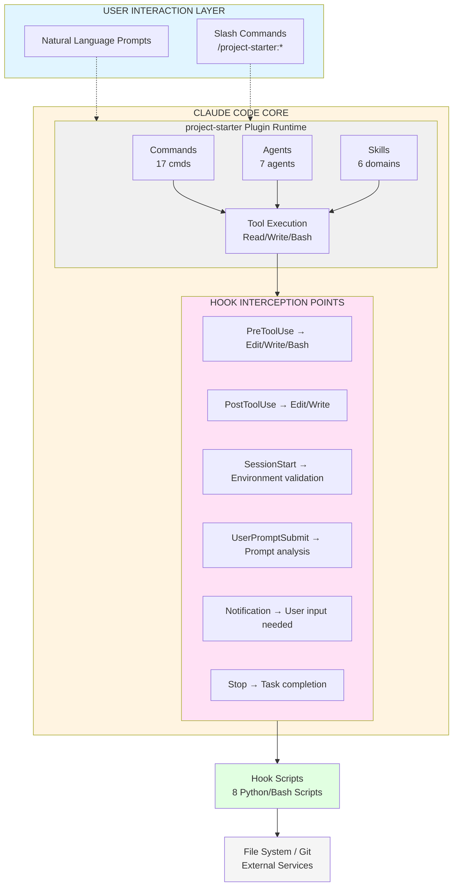
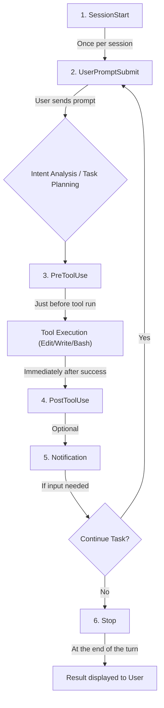

# Architecture Documentation: project-starter Plugin

> **Last Updated**: 2026-01-04
> **Version**: 1.0.0
> **Maintainer**: CloudAI-X

---

## Table of Contents

- [Overview](#overview)
- [System Architecture](#system-architecture)
- [Component Architecture](#component-architecture)
- [Data Flow](#data-flow)
- [Agent Interaction Patterns](#agent-interaction-patterns)
- [Technology Stack](#technology-stack)
- [Design Patterns](#design-patterns)
- [Security Architecture](#security-architecture)
- [File Organization](#file-organization)
- [Architectural Principles](#architectural-principles)

---

## Overview

The **project-starter** is a universal Claude Code workflow plugin that extends Claude's capabilities through specialized agents, commands, skills, and automation hooks for software development workflows.

### Context

This plugin provides a comprehensive framework for:

- Complex multi-step task orchestration
- Specialized domain expertise (security, testing, documentation)
- Automated code quality gates
- Git workflow automation
- Real-time security scanning

---

## System Architecture



---

## Component Architecture

```mermaid
graph TB
    ROOT[project-starter]

    subgraph ENTRY["ENTRY POINTS - User Interface"]
        CMD_LAYER["Commands Layer<br/>17 commands"]
        CMD_OUTPUT["Output Styles<br/>/architect, /rapid, /mentor, /review"]
        CMD_GIT["Git Workflow<br/>/commit, /commit-push-pr, /sync-branch"]
        CMD_VERIFY["Verification<br/>/verify-changes, /run-tests, /lint-check"]
        CMD_QUICK["Quick Actions<br/>/quick-fix, /add-tests, /lint-fix"]
        NL_TRIGGER["Natural Language<br/>Auto-triggers Agents/Skills"]
    end

    subgraph EXEC["EXECUTION LAYER"]
        subgraph AGENTS["Agents - Specialized Sub-agents"]
            ORCH["orchestrator<br/>Coordinates multi-step tasks<br/>Model: opus"]
            REVIEW["code-reviewer<br/>Quality gates & best practices<br/>Model: sonnet"]
            DEBUG["debugger<br/>Systematic error investigation<br/>Model: sonnet"]
            DOCS["docs-writer<br/>Technical documentation<br/>Model: sonnet"]
            SEC["security-auditor<br/>Vulnerability detection<br/>Model: sonnet"]
            REFACT["refactorer<br/>Code structure improvement<br/>Model: sonnet"]
            TEST["test-architect<br/>Test strategy & implementation<br/>Model: sonnet"]
        end

        subgraph SKILLS["Skills - Knowledge Domains"]
            SKILL1["analyzing-projects<br/>Codebase exploration"]
            SKILL2["designing-tests<br/>Testing strategies"]
            SKILL3["designing-architecture<br/>Architecture patterns"]
            SKILL4["designing-apis<br/>REST/GraphQL practices"]
            SKILL5["managing-git<br/>Version control"]
            SKILL6["optimizing-performance<br/>Performance analysis"]
        end
    end

    subgraph AUTO["AUTOMATION LAYER"]
        subgraph HOOKS["Hooks - Event-driven Scripts"]
            SESS["SessionStart Hook<br/>validate-environment.py"]
            PROMPT["UserPromptSubmit Hook<br/>validate-prompt.py"]
            PRE["PreToolUse Hooks<br/>protect-files.py<br/>security-check.py<br/>log-commands.sh"]
            POST["PostToolUse Hooks<br/>format-on-edit.py"]
            NOTIF["Notification Hook<br/>notify-input.sh"]
            STOP["Stop Hook<br/>notify-complete.sh"]
        end
    end

    subgraph CONFIG["CONFIGURATION"]
        MANIFEST["plugin.json<br/>Plugin manifest"]
        HOOKS_JSON["hooks.json<br/>Hook registration"]
        CLAUDE_MD["CLAUDE.md<br/>Development guidelines"]
        TEMPLATES["templates/<br/>Project templates"]
    end

    ROOT --> ENTRY
    ROOT --> EXEC
    ROOT --> AUTO
    ROOT --> CONFIG

    CMD_LAYER --> CMD_OUTPUT
    CMD_LAYER --> CMD_GIT
    CMD_LAYER --> CMD_VERIFY
    CMD_LAYER --> CMD_QUICK

    style ENTRY fill:#e1f5ff
    style EXEC fill:#fff4e1
    style AGENTS fill:#ffe1e1
    style SKILLS fill:#e1ffe1
    style AUTO fill:#ffe1f5
    style HOOKS fill:#f5e1ff
    style CONFIG fill:#f5f5f5
```



### Component Details

#### 1. Commands Layer

**Purpose**: User-facing interface for common workflows

| Category          | Commands                                                                       | Description                        |
| ----------------- | ------------------------------------------------------------------------------ | ---------------------------------- |
| **Output Styles** | `architect`, `rapid`, `mentor`, `review`                                       | Change Claude's communication mode |
| **Git Workflow**  | `commit`, `commit-push-pr`, `sync-branch`, `summarize-changes`                 | Automate version control           |
| **Verification**  | `verify-changes`, `run-tests`, `lint-check`, `security-scan`, `validate-build` | Quality gates                      |
| **Quick Actions** | `quick-fix`, `add-tests`, `lint-fix`, `code-simplifier`                        | Productivity shortcuts             |

**Key Features**:

- Declarative tool permissions via YAML frontmatter
- Dynamic context injection with `!` command syntax
- Argument hints for user guidance

#### 2. Agents Layer

**Purpose**: Specialized AI sub-agents for complex tasks

| Agent              | Model  | Trigger Keywords                          | Primary Tools           |
| ------------------ | ------ | ----------------------------------------- | ----------------------- |
| `orchestrator`     | opus   | "improve", "refactor", multi-module tasks | All + Task, TodoWrite   |
| `code-reviewer`    | sonnet | Post-code changes, pre-commit             | Read, Grep, Glob, Bash  |
| `debugger`         | sonnet | "error", "bug", test failures             | Read, Edit, Bash, Grep  |
| `docs-writer`      | sonnet | "document", "README", doc updates         | Read, Write, Edit       |
| `security-auditor` | sonnet | "security", auth/input handling           | Read, Grep, Glob, Bash  |
| `refactorer`       | sonnet | "clean up", "simplify", tech debt         | Read, Write, Edit, Grep |
| `test-architect`   | sonnet | "test", "coverage"                        | Read, Write, Edit, Bash |

**Delegation Pattern**:

- Orchestrator spawns specialists via `Task` tool
- Each agent has constrained tool access (principle of least privilege)
- Opus model for coordination, Sonnet for execution (cost optimization)

#### 3. Skills Layer

**Purpose**: Domain knowledge automatically injected into agent context

| Skill                    | Use Cases                        | Knowledge Areas                              |
| ------------------------ | -------------------------------- | -------------------------------------------- |
| `analyzing-projects`     | Codebase onboarding, exploration | Project structure, tech stack detection      |
| `designing-tests`        | Test strategy, coverage planning | Unit/integration/E2E patterns                |
| `designing-architecture` | System design                    | Clean architecture, hexagonal, microservices |
| `designing-apis`         | API development                  | REST/GraphQL, versioning, error handling     |
| `managing-git`           | Version control                  | Branching, commits, PRs, conflicts           |
| `optimizing-performance` | Performance tuning               | Profiling, caching, query optimization       |

**Auto-application Logic**:

- Skills loaded when keywords match in user prompt or agent task
- Language-agnostic (applicable across tech stacks)
- Keep under 500 lines for optimal context usage

#### 4. Hooks Layer

**Purpose**: Event-driven automation and safety gates

**Hook Types**:

```
SessionStart
  └─ Runs once when Claude Code starts
     Use: Environment validation, setup checks

UserPromptSubmit
  └─ Runs on every user input
     Use: Prompt analysis, agent suggestions

PreToolUse
  └─ Runs before tool execution
     Use: Security checks, file protection
     Exit codes: 0=allow, 2=block

PostToolUse
  └─ Runs after tool execution
     Use: Auto-formatting, cleanup

Notification
  └─ Runs when user input needed
     Use: Desktop notifications

Stop
  └─ Runs when task completes
      └─→ notify-complete.sh (Completion notification)
```

**Hook Execution Order**:



| Order | Hook               | Assigned Scripts (Files)                                   | Trigger Timing                         | Primary Use Case                             |
| :---- | :----------------- | :--------------------------------------------------------- | :------------------------------------- | :------------------------------------------- |
| **1** | `SessionStart`     | `validate-environment.py`                                  | When Claude Code initializes           | Environment validation, dependency checks    |
| **2** | `UserPromptSubmit` | `validate-prompt.py`                                       | Every time user sends a prompt         | Intent analysis, suggesting relevant agents  |
| **3** | `PreToolUse`       | `protect-files.py`, `security-check.py`, `log-commands.sh` | Just before any tool (Read/Write/Bash) | Security gates, protecting sensitive files   |
| **4** | `PostToolUse`      | `format-on-edit.py`                                        | Immediately after a tool succeeds      | Auto-formatting code, cleanup tasks          |
| **5** | `Notification`     | `notify-input.sh`                                          | When Claude needs user input/updates   | Desktop or external service notifications    |
| **6** | `Stop`             | `notify-complete.sh`                                       | After logical steps are complete       | Task completion alerts, final status reports |

**Hook Exit Code Protocol**:

- `0`: Allow operation to proceed
- `2`: Block operation with message to user
- Non-zero (except 2): Silently fail (don't block)

---

## Data Flow

```
                    ┌─────────────┐
                    │    USER     │
                    └──────┬──────┘
                           │
                    [Input: Prompt or /command]
                           │
                           ▼
         ┌─────────────────────────────────────┐
         │   SessionStart Hook                 │
         │   └→ validate-environment.py        │
         └─────────────────┬───────────────────┘
                           │
                           ▼
         ┌─────────────────────────────────────┐
         │   UserPromptSubmit Hook             │
         │   └→ validate-prompt.py             │
         │      (Suggests matching agents)     │
         └─────────────────┬───────────────────┘
                           │
            ┌──────────────┴──────────────┐
            │                             │
            ▼                             ▼
    ┌───────────────┐           ┌──────────────────┐
    │   Command     │           │  Natural Lang.   │
    │   Execution   │           │  Task Analysis   │
    └───────┬───────┘           └────────┬─────────┘
            │                            │
            │                            ▼
            │                  ┌──────────────────┐
            │                  │  Auto-trigger    │
            │                  │  Agents/Skills   │
            │                  └────────┬─────────┘
            └──────────────┬────────────┘
                           │
                           ▼
            ┌──────────────────────────────┐
            │   Agent spawns via Task tool │
            │   (orchestrator → specialists)│
            └──────────────┬───────────────┘
                           │
                           ▼
            ┌──────────────────────────────┐
            │   Tool Execution Request     │
            │   (Read, Write, Edit, Bash)  │
            └──────────────┬───────────────┘
                           │
                           ▼
            ┌──────────────────────────────┐
            │   PreToolUse Hooks           │
            │   ├→ protect-files.py        │
            │   ├→ security-check.py       │
            │   └→ log-commands.sh         │
            │                               │
            │   [Exit code 0=allow, 2=block]│
            └──────────────┬───────────────┘
                           │
                    [If allowed]
                           │
                           ▼
            ┌──────────────────────────────┐
            │   Execute Tool Action        │
            │   (Modify files, run cmds)   │
            └──────────────┬───────────────┘
                           │
                           ▼
            ┌──────────────────────────────┐
            │   PostToolUse Hooks          │
            │   └→ format-on-edit.py       │
            │      (Auto-format files)     │
            └──────────────┬───────────────┘
                           │
                           ▼
            ┌──────────────────────────────┐
            │   Return Results to Agent    │
            └──────────────┬───────────────┘
                           │
                           ▼
            ┌──────────────────────────────┐
            │   Agent Completes Task       │
            └──────────────┬───────────────┘
                           │
                           ▼
            ┌──────────────────────────────┐
            │   Stop Hook                  │
            │   └→ notify-complete.sh      │
            └──────────────┬───────────────┘
                           │
                           ▼
                    ┌─────────────┐
                    │   RESULT    │
                    │   to USER   │
                    └─────────────┘
```

### Critical Paths

**1. Command Execution Path**

```
User → /commit → Command context injection → Git operations → Hooks → Result
```

**2. Agent Delegation Path**

```
User → Complex task → orchestrator → Task(specialist) → Synthesize → Result
```

**3. Security Gate Path**

```
Write(.env) → PreToolUse(protect-files.py) → Exit 2 → BLOCKED → User warning
```

---

## Agent Interaction Patterns

### Pattern 1: Orchestrator Delegation

```
┌──────────────────────────────────────────────────────────────────┐
│                    ORCHESTRATOR PATTERN                           │
│                    (Complex Multi-step Tasks)                     │
└──────────────────────────────────────────────────────────────────┘

User: "Add authentication to the API"
  │
  ▼
┌─────────────────────────────────────────┐
│   orchestrator agent (opus model)       │
│                                          │
│   1. Analyze request                     │
│   2. Create TodoWrite plan               │
│   3. Delegate to specialists             │
└──────────────┬──────────────────────────┘
               │
     ┌─────────┴──────────┬─────────────┬──────────────┐
     │                    │             │              │
     ▼                    ▼             ▼              ▼
┌─────────────┐    ┌──────────┐  ┌──────────┐   ┌────────────┐
│ Task tool   │    │Task tool │  │Task tool │   │ Task tool  │
│ ↓           │    │    ↓     │  │    ↓     │   │     ↓      │
│security-    │    │test-     │  │docs-     │   │code-       │
│auditor      │    │architect │  │writer    │   │reviewer    │
└─────────────┘    └──────────┘  └──────────┘   └────────────┘
     │                    │             │              │
     └─────────┬──────────┴─────────────┴──────────────┘
               │
               ▼
     ┌─────────────────────────┐
     │  orchestrator synthesizes│
     │  all results             │
     │  → Final implementation  │
     └─────────────────────────┘
```

### Pattern 2: Direct Specialist Invocation

```
User: "Review my code changes"
  │
  ▼
┌─────────────────────────────┐
│  Auto-trigger detection      │
│  "review" keyword found      │
└──────────────┬───────────────┘
               │
               ▼
┌─────────────────────────────┐
│  code-reviewer agent         │
│  (sonnet model)              │
│                              │
│  1. Read changed files       │
│  2. Analyze patterns         │
│  3. Check best practices     │
│  4. Return feedback          │
└──────────────┬───────────────┘
               │
               ▼
         User receives
         detailed review
```

### Pattern 3: Skill Auto-Application

```
User: "How should I structure my payment service?"
  │
  ▼
┌─────────────────────────────┐
│  Context analysis            │
│  "structure" + "service"     │
│  → architecture design       │
└──────────────┬───────────────┘
               │
               ▼
┌─────────────────────────────┐
│  designing-architecture      │
│  skill loaded                │
│                              │
│  Knowledge injected:         │
│  - Hexagonal architecture    │
│  - DDD patterns              │
│  - Separation of concerns    │
└──────────────┬───────────────┘
               │
               ▼
         Claude provides
         architectural guidance
```

---

## Technology Stack

### Runtime Environment

```
┌────────────────────────────────────────┐
│         RUNTIME ENVIRONMENT            │
│                                        │
│  Claude Code CLI (v1.0.33+)           │
│  └─ Anthropic LLM API                 │
│     ├─ Opus 4.5 (orchestrator)        │
│     └─ Sonnet 4.5 (specialists)       │
└────────────────────────────────────────┘
```

### Hook Scripting

```
┌────────────────────────────────────────┐
│         HOOK SCRIPTING                 │
│                                        │
│  Python 3 (main automation scripts)    │
│  └─ JSON parsing (stdin/stdout)        │
│  └─ Regex pattern matching             │
│  └─ Subprocess execution               │
│                                        │
│  Bash (command logging, notifications) │
│  └─ osascript (macOS notifications)    │
│  └─ File I/O operations                │
└────────────────────────────────────────┘
```

### Plugin Definition

```
┌────────────────────────────────────────┐
│         PLUGIN DEFINITION              │
│                                        │
│  JSON (plugin.json, hooks.json)        │
│  └─ Plugin manifest                    │
│  └─ Hook configuration                 │
│                                        │
│  Markdown (agents, commands, skills)   │
│  └─ YAML Frontmatter (metadata)        │
│  └─ Instructions in body               │
└────────────────────────────────────────┘
```

### External Dependencies

```
┌────────────────────────────────────────┐
│         EXTERNAL DEPENDENCIES          │
│                                        │
│  Git (version control operations)      │
│  └─ Required for commit/PR commands    │
│                                        │
│  Node.js (optional, for npm projects)  │
│  └─ Used by validate-environment.py    │
│                                        │
│  Prettier/Black/Gofmt (optional)       │
│  └─ Used by format-on-edit.py          │
└────────────────────────────────────────┘
```

---

## Design Patterns

### 1. Command Pattern

**Intent**: Encapsulate workflows as declarative commands

**Implementation**:

```markdown
---
allowed-tools: Bash(git:*), Read, Write
description: Auto-generate conventional commit
argument-hint: [optional scope]
---

## Context

- Current branch: !`git branch --show-current`
- Git status: !`git status --short`

## Task

Generate and execute commit with conventional message...
```

**Benefits**:

- Tool permission restrictions (security)
- Dynamic context injection via `!` syntax
- Reusable workflow definitions
- Self-documenting commands

### 2. Agent Pattern (Delegation & Specialization)

**Intent**: Divide complex tasks among specialized sub-agents

**Implementation**:

```markdown
---
name: orchestrator
description: Master coordinator. Use PROACTIVELY when...
tools: Read, Write, Edit, Task, TodoWrite
model: opus
---

# Orchestrator Agent

Delegate to specialists:

- code-reviewer for quality
- test-architect for tests
- security-auditor for vulnerabilities
```

**Benefits**:

- Single responsibility per agent
- Optimal model selection (opus for coordination, sonnet for execution)
- Parallel task execution
- Expertise specialization

**Collaboration Pattern**:

```
orchestrator (opus)
  ├─ spawns → code-reviewer (sonnet)
  ├─ spawns → test-architect (sonnet)
  ├─ spawns → security-auditor (sonnet)
  └─ synthesizes → unified result
```

### 3. Hook Pattern (Event Interception)

**Intent**: Execute automated checks/actions at lifecycle events

**Implementation** (`hooks.json`):

```json
{
  "hooks": {
    "PreToolUse": [
      {
        "matcher": "Edit|Write",
        "hooks": [
          {
            "type": "command",
            "command": "python3 '${CLAUDE_PLUGIN_ROOT}/hooks/scripts/security-check.py'"
          }
        ]
      }
    ]
  }
}
```

**Exit Code Protocol**:

- `0`: Allow operation
- `2`: Block operation with user message
- Other: Silent failure (don't block)

**Benefits**:

- Automated security gates
- Consistent formatting
- Audit trail (command logging)
- User notifications

### 4. Skill Pattern (Domain Knowledge Injection)

**Intent**: Provide specialized domain knowledge on-demand

**Implementation**:

```markdown
---
name: designing-architecture
description: Analyzes architectural patterns...
---

# Architecture Design Patterns

[500 lines of architecture knowledge]

- Clean architecture
- Hexagonal architecture
- Microservices patterns
```

**Auto-application Logic**:

1. User prompt contains architecture keywords
2. Skill loaded into agent context
3. Agent uses knowledge to respond

**Benefits**:

- Knowledge reuse across agents
- Language-agnostic expertise
- Contextual loading (avoid bloat)

### 5. Template Pattern (Configuration Reuse)

**Intent**: Provide starter configurations for users

**Implementation**:

```
templates/
├── settings.local.json.template  # Permission presets
└── CLAUDE.md.template            # Team conventions
```

**Usage**:

```bash
cp templates/settings.local.json.template .claude/settings.local.json
# Customize for project needs
```

**Benefits**:

- Faster onboarding
- Consistent configuration
- Best practice defaults

---

## Security Architecture

### Multi-Layered Defense

```
┌─────────────────────────────────────────────────────┐
│              SECURITY LAYERS                         │
└─────────────────────────────────────────────────────┘

Layer 1: File Protection
  └─→ protect-files.py
      ├─ Blocks: .env, .git/*, package-lock.json, etc.
      ├─ Prevents accidental config damage
      └─ Exit code 2 prevents dangerous edits

Layer 2: Secret Detection
  └─→ security-check.py
      ├─ Regex patterns for API keys, tokens
      ├─ Detects: AWS keys, private keys, passwords
      ├─ Patterns: PRIVATE KEY, aws_secret, etc.
      └─ Blocks commits with detected secrets

Layer 3: Command Auditing
  └─→ log-commands.sh
      ├─ Logs all Bash commands
      ├─ Location: .claude/command-history.log
      └─ Enables debugging and audit trails

Layer 4: Agent Permissions
  └─→ Defined in agent frontmatter
      ├─ permissionMode: default/strict
      ├─ Tool restrictions per agent
      └─ Principle of least privilege

Layer 5: Tool Allowlists
  └─→ Commands specify allowed-tools
      ├─ Example: Bash(git:*) only git commands
      ├─ Prevents arbitrary command execution
      └─ Scoped to command requirements
```

### Threat Model

| Threat                      | Mitigation                                  | Layer   |
| --------------------------- | ------------------------------------------- | ------- |
| Accidental secret commit    | `security-check.py` regex scanning          | Layer 2 |
| .env file modification      | `protect-files.py` blocks Edit/Write        | Layer 1 |
| Lock file corruption        | `protect-files.py` blocks package-lock.json | Layer 1 |
| Malicious bash commands     | Tool allowlists (e.g., `Bash(git:*)`)       | Layer 5 |
| Unauthorized file access    | Agent tool restrictions                     | Layer 4 |
| Untracked command execution | `log-commands.sh` audit log                 | Layer 3 |

### Security Patterns

**Pattern 1: Protected File List**

```python
# protect-files.py
PROTECTED_PATTERNS = [
    r'\.env',
    r'\.git/',
    r'package-lock\.json',
    r'yarn\.lock',
    # ...
]
```

**Pattern 2: Secret Detection**

```python
# security-check.py
SECRET_PATTERNS = [
    (r'PRIVATE KEY', 'Private key detected'),
    (r'aws_secret_access_key.*[A-Za-z0-9/+=]{40}', 'AWS secret key'),
    # ...
]
```

**Pattern 3: Command Allowlist**

```yaml
# commands/commit.md
allowed-tools: Bash(git status:*), Bash(git diff:*), Bash(git commit:*)
```

---

## File Organization

### Directory Structure

```
claude-workflow/
├── .claude-plugin/          # Plugin metadata
│   ├── plugin.json          # Manifest: name, version, author
│   └── marketplace.json     # Marketplace metadata (optional)
│
├── agents/                  # 7 specialized sub-agents
│   ├── orchestrator.md      # Master coordinator (opus)
│   ├── code-reviewer.md     # Quality gates (sonnet)
│   ├── debugger.md          # Error investigation (sonnet)
│   ├── docs-writer.md       # Documentation (sonnet)
│   ├── security-auditor.md  # Vulnerability scanning (sonnet)
│   ├── refactorer.md        # Code cleanup (sonnet)
│   └── test-architect.md    # Test strategy (sonnet)
│
├── commands/                # 17 user-invocable commands
│   ├── architect.md         # System design mode
│   ├── rapid.md             # Fast development mode
│   ├── mentor.md            # Teaching mode
│   ├── review.md            # Code review mode
│   ├── commit.md            # Auto-generate commit
│   ├── commit-push-pr.md    # Full git workflow
│   ├── quick-fix.md         # Fix lint/type errors
│   ├── add-tests.md         # Generate tests
│   ├── lint-fix.md          # Auto-fix linting
│   ├── lint-check.md        # Check code quality
│   ├── sync-branch.md       # Sync with main
│   ├── summarize-changes.md # Generate summaries
│   ├── verify-changes.md    # Multi-agent verification
│   ├── validate-build.md    # Build verification
│   ├── run-tests.md         # Intelligent test runner
│   ├── security-scan.md     # Security checks
│   └── code-simplifier.md   # Post-implementation cleanup
│
├── skills/                  # 6 knowledge domains
│   ├── analyzing-projects/
│   │   └── SKILL.md         # Codebase exploration
│   ├── designing-apis/
│   │   └── SKILL.md         # REST/GraphQL patterns
│   ├── designing-architecture/
│   │   └── SKILL.md         # Architecture patterns
│   ├── designing-tests/
│   │   └── SKILL.md         # Testing strategies
│   ├── managing-git/
│   │   └── SKILL.md         # Version control workflows
│   └── optimizing-performance/
│       └── SKILL.md         # Performance tuning
│
├── hooks/                   # Automation layer
│   ├── hooks.json           # Hook registration & matchers
│   └── scripts/             # 8 automation scripts
│       ├── protect-files.py        # Block dangerous edits
│       ├── security-check.py       # Secret detection
│       ├── format-on-edit.py       # Auto-formatting
│       ├── log-commands.sh         # Command logging
│       ├── validate-environment.py # Check dependencies
│       ├── validate-prompt.py      # Suggest agents
│       ├── notify-input.sh         # Input notifications
│       └── notify-complete.sh      # Completion alerts
│
├── templates/               # User-facing templates
│   ├── settings.local.json.template  # Permission presets
│   └── CLAUDE.md.template            # Team conventions
│
├── .github/                 # GitHub integration
│   └── workflows/           # CI/CD (if applicable)
│
├── ARCHITECTURE.md          # This file
├── CLAUDE.md                # Development guidelines
├── README.md                # User documentation (Japanese)
├── README_EN.md             # User documentation (English)
├── CONTRIBUTING.md          # Contribution guide
├── CODE_OF_CONDUCT.md       # Community guidelines
├── CHANGELOG.md             # Version history
├── LICENSE                  # MIT license
├── PERMISSIONS.md           # Permission documentation
└── mcp-servers-template.md  # MCP server configs
```

### File Naming Conventions

| Type      | Pattern                   | Example                   |
| --------- | ------------------------- | ------------------------- |
| Agents    | `{name}.md`               | `orchestrator.md`         |
| Commands  | `{name}.md`               | `commit-push-pr.md`       |
| Skills    | `SKILL.md` (in named dir) | `designing-apis/SKILL.md` |
| Hooks     | `{action}-{target}.py/sh` | `protect-files.py`        |
| Templates | `{name}.template`         | `CLAUDE.md.template`      |
| Docs      | `{NAME}.md`               | `ARCHITECTURE.md`         |

### Metadata Format (YAML Frontmatter)

**Agent Metadata**:

```yaml
---
name: orchestrator
description: Master coordinator for complex tasks...
tools: Read, Write, Edit, Task, TodoWrite
model: opus
permissionMode: default
skills: project-analysis, architecture-patterns
---
```

**Command Metadata**:

```yaml
---
allowed-tools: Bash(git:*), Read, Write
description: Auto-generate conventional commit
argument-hint: [optional scope]
---
```

**Skill Metadata**:

```yaml
---
name: designing-architecture
description: Analyzes architectural patterns...
---
```

---

## Architectural Principles

### 1. Modularity

**Principle**: Each component is independent and reusable

**Implementation**:

- Agents are self-contained Markdown files
- Commands have no dependencies on other commands
- Skills are loaded on-demand
- Hooks are stateless scripts

**Benefits**:

- Easy to add/remove components
- No cascading failures
- Simple testing in isolation

### 2. Specialization (Single Responsibility)

**Principle**: Each agent/command focuses on one domain

**Implementation**:

- `code-reviewer` only reviews code quality
- `security-auditor` only checks vulnerabilities
- `test-architect` only handles testing
- `docs-writer` only creates documentation

**Benefits**:

- Clear ownership of functionality
- Easier to optimize per-domain
- Predictable behavior

### 3. Delegation (Orchestrator Pattern)

**Principle**: Complex tasks are coordinated, not monolithic

**Implementation**:

```
User: "Add authentication"
  ↓
orchestrator analyzes
  ↓
├─ security-auditor (check patterns)
├─ test-architect (create tests)
├─ docs-writer (update docs)
└─ code-reviewer (final review)
  ↓
orchestrator synthesizes
```

**Benefits**:

- Parallel execution where possible
- Expert agents for each subtask
- Clear task decomposition

### 4. Safety (Defense in Depth)

**Principle**: Multiple layers prevent catastrophic errors

**Implementation**:

- Layer 1: File protection (protect-files.py)
- Layer 2: Secret detection (security-check.py)
- Layer 3: Command logging (log-commands.sh)
- Layer 4: Agent permissions (tool restrictions)
- Layer 5: Tool allowlists (command-level)

**Benefits**:

- No single point of failure
- Redundant protections
- Audit trails

### 5. Extensibility

**Principle**: New capabilities can be added without modifying core

**Implementation**:

- Add agent: Create `agents/{name}.md`
- Add command: Create `commands/{name}.md`
- Add skill: Create `skills/{name}/SKILL.md`
- Add hook: Register in `hooks.json`, add script

**Benefits**:

- Plugin ecosystem potential
- User customization
- Backward compatibility

### 6. Convention over Configuration

**Principle**: Sensible defaults, minimal setup required

**Implementation**:

- Auto-detection of project type
- Default tool permissions
- Conventional commit message format
- Standard directory structure

**Benefits**:

- Faster onboarding
- Reduced cognitive load
- Consistent behavior

### 7. Fail-Safe Defaults

**Principle**: Errors should not block user workflows

**Implementation**:

```python
try:
    # Hook logic
except Exception:
    sys.exit(0)  # Don't block on errors
```

**Benefits**:

- Graceful degradation
- User workflow continuity
- Predictable behavior

---

## Extension Points

### Adding a New Agent

1. Create `agents/my-agent.md`:

```markdown
---
name: my-agent
description: What it does. Use PROACTIVELY when...
tools: Read, Write, Edit
model: sonnet
---

# My Agent

Instructions for the agent...
```

2. Test:

```bash
claude plugin validate
claude --plugin-dir ./ "trigger my agent"
```

### Adding a New Command

1. Create `commands/my-command.md`:

```markdown
---
allowed-tools: Bash(npm:*), Read
description: What this command does
argument-hint: [optional args]
---

## Task

Instructions for the command...
```

2. Test:

```bash
claude plugin validate
claude --plugin-dir ./ "/project-starter:my-command"
```

### Adding a New Hook

1. Create `hooks/scripts/my-hook.py`:

```python
#!/usr/bin/env python3
import json
import sys

def main():
    try:
        input_data = json.load(sys.stdin)
        # Process input_data
        # Exit 0 to allow, exit 2 to block
        sys.exit(0)
    except Exception:
        sys.exit(0)  # Don't block on errors

if __name__ == '__main__':
    main()
```

2. Register in `hooks/hooks.json`:

```json
{
  "hooks": {
    "PreToolUse": [
      {
        "matcher": "Edit|Write",
        "hooks": [
          {
            "type": "command",
            "command": "python3 '${CLAUDE_PLUGIN_ROOT}/hooks/scripts/my-hook.py'"
          }
        ]
      }
    ]
  }
}
```

3. Test:

```bash
chmod +x hooks/scripts/my-hook.py
claude plugin validate
```

---

## Performance Considerations

### Model Selection Strategy

| Task Complexity        | Model  | Rationale                    |
| ---------------------- | ------ | ---------------------------- |
| Coordination, planning | opus   | Highest reasoning capability |
| Specialized execution  | sonnet | Balanced cost/performance    |
| Simple formatting      | haiku  | Fast, cheap (future use)     |

**Cost Optimization**:

- Use opus only for orchestrator (high-level decisions)
- Use sonnet for all specialists (execution)
- Minimize token usage with concise agent instructions

### Context Management

**Skill Size Limits**:

- Keep skills under 500 lines
- Split large domains into multiple skills
- Load only relevant skills per task

**Agent Context**:

- Each agent sees only its tool results
- Orchestrator aggregates results
- Avoids context bloat

### Parallel Execution

**Opportunities**:

```python
# Orchestrator spawns in parallel:
Task(security-auditor)  # Run concurrently
Task(test-architect)    # Run concurrently
Task(docs-writer)       # Run concurrently
# Wait for all, then synthesize
```

**Limitations**:

- Sequential dependencies (e.g., test after implementation)
- Tool execution is sequential (Read, Write, Edit)

---

## Future Enhancements

### Potential Improvements

1. **Skill Marketplace**
   - User-contributed skills
   - Domain-specific knowledge (Rust, Go, React, etc.)

2. **Agent Composition**
   - Agents that spawn other agents
   - Dynamic task graphs

3. **Hook Marketplace**
   - Community-contributed hooks
   - Language-specific formatters

4. **Telemetry & Analytics**
   - Agent success metrics
   - Command usage statistics
   - Performance profiling

5. **Multi-Repository Support**
   - Cross-repo refactoring
   - Monorepo tooling
   - Dependency analysis

6. **IDE Integration**
   - VSCode extension
   - JetBrains plugin
   - Real-time agent suggestions

---

## Troubleshooting

### Common Issues

**Hook not executing**

- Check `hooks/hooks.json` matcher regex
- Verify script has executable permissions (`chmod +x`)
- Check Python path (`#!/usr/bin/env python3`)

**Agent not triggering**

- Ensure "PROACTIVELY" is in description
- Check trigger keywords in user prompt
- Verify model name is valid (opus/sonnet/haiku)

**Validation failing**

- Run `claude plugin validate` for specific errors
- Check JSON syntax in all config files
- Verify all referenced files exist

### Debug Commands

```bash
# Validate plugin structure
claude plugin validate

# Test plugin locally
claude --plugin-dir ./

# Check hook execution
cat .claude/command-history.log

# View agent list
/plugin → Installed tab

# Check permissions
cat .claude/settings.local.json
```

---

## References

- [Claude Code Documentation](https://code.claude.com)
- [Plugin Development Guide](https://docs.anthropic.com/claude-code)
- [Conventional Commits](https://www.conventionalcommits.org/)
- [OWASP Top 10](https://owasp.org/www-project-top-ten/)

---

**Document Maintenance**:

- Review architecture doc with each major version release
- Update diagrams when adding/removing components
- Keep troubleshooting section current with user feedback

**Contributors**: See [CONTRIBUTING.md](./CONTRIBUTING.md) for how to propose architectural changes.
